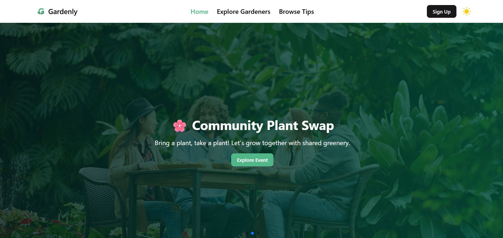

# 🌿 Gardenly - A Gardening Community & Resource Hub

### 🔗 Live Site: [https://gardenly-community.netlify.app](https://gardenly-community.netlify.app)

---

## 🌟 Project Description

Gardenly is a community-driven platform built for gardening enthusiasts to share tips, explore gardening knowledge, join events, and connect with like-minded people. Whether you’re a beginner or an expert, Gardenly helps grow your green passion through collaboration, inspiration, and learning.

---

## 🚀 Features

- ✅ **Public Tips Browsing** – Explore a wide range of plant care advice, composting techniques, and hydroponics guidance shared by community members.
- ✍️ **Tip Sharing System** – Authenticated users can share their own gardening tips with title, images, categories, and more.
- 🌟 **Featured Gardeners Section** – Highlights active gardeners and their contributions, shown on the homepage.
- 📈 **Trending Tips Section** – Displays the most liked and appreciated gardening tips by the community.
- 📅 **Upcoming Gardening Events** – View a list of relevant workshops, seminars, and local meetups with registration options.
- 🌙 **Dark Mode Support** – User-friendly theme toggle with a visually appealing greenish dark aesthetic.
- 🔐 **Protected Routes** – Only logged-in users can share or view their own tips.
- 📱 **Responsive Design** – Fully mobile-optimized and responsive across all screen sizes.

---

## 🛠️ Tech Stack

- **Frontend**: React.js, TailwindCSS (with ShadCN), Vite
- **State Management**: React Context + Custom Hooks
- **Routing**: React Router DOM
- **Backend**: Express.js, MongoDB (for full-stack versions)
- **Authentication**: Firebase Auth
- **UI Libraries**: React Icons, SwiperJS, Sonner for notifications

---

## 💡 Credits

Designed and developed by KAWSAR KABIR  
Copyright © 2025

---
